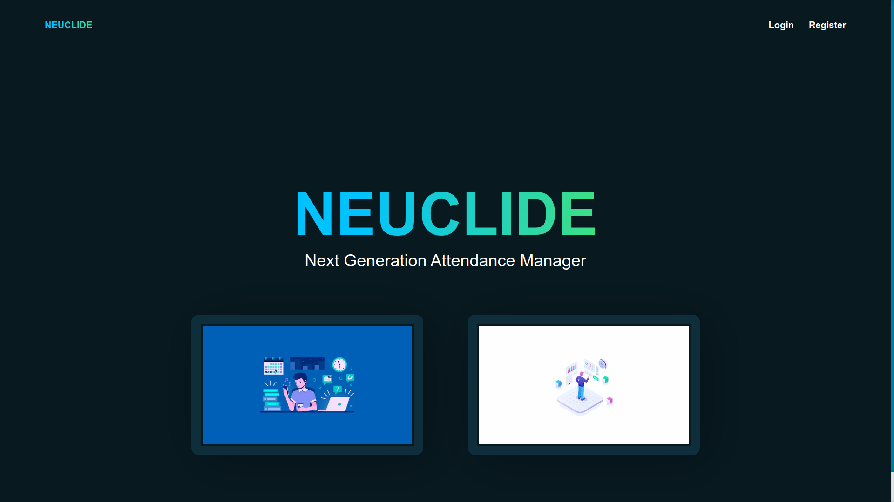
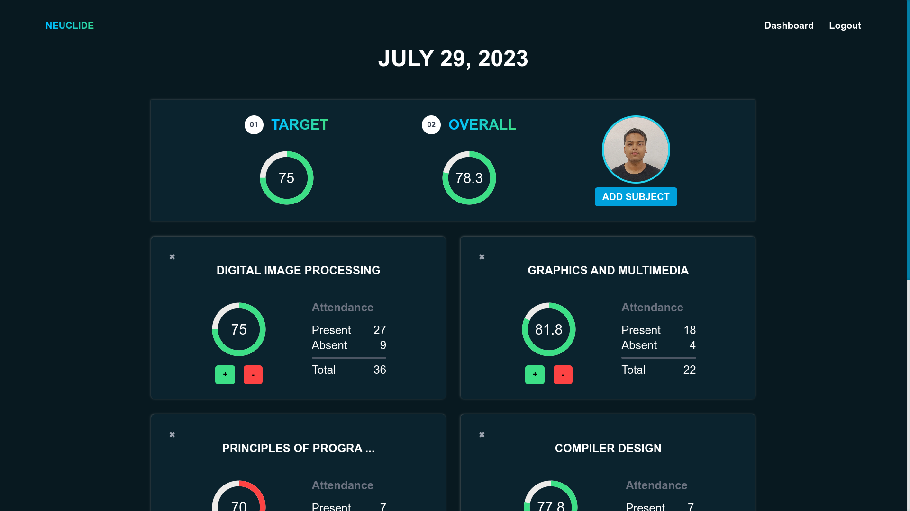
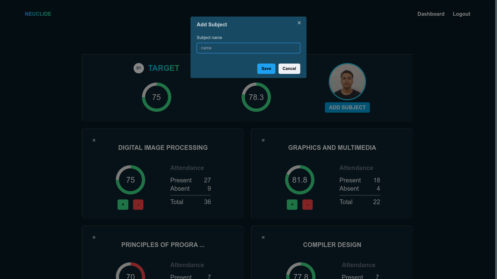

## Attendance Manager
---
### Technologies Used
- Next
- Chakra UI
- Express
- Mongodb
- Mongoose
---
### Salient Features
- User Registration
- User Login/Logout
- View Attendance Dashboard
- Add Subject
- Mark Present/Absent
---
### Setup Locally

#### Database
- Create a new mongodb database

#### Server
- `cd ./server`
- install the dependencies
  - `yarn` / `npm install`
- copy `envexample` to `.env` and fill the contents
- run the server
  - `yarn devstart`

#### Client
- `cd ./client`
- install the required node modules 
  - `yarn` / `npm install`
- run it 
  - `yarn dev`

---

### Some Screenshots

